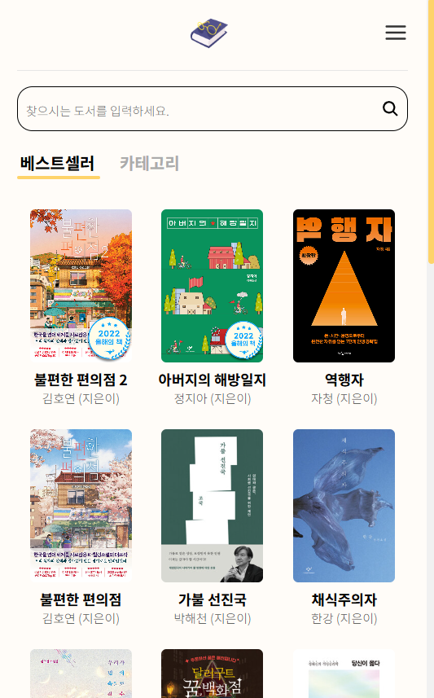
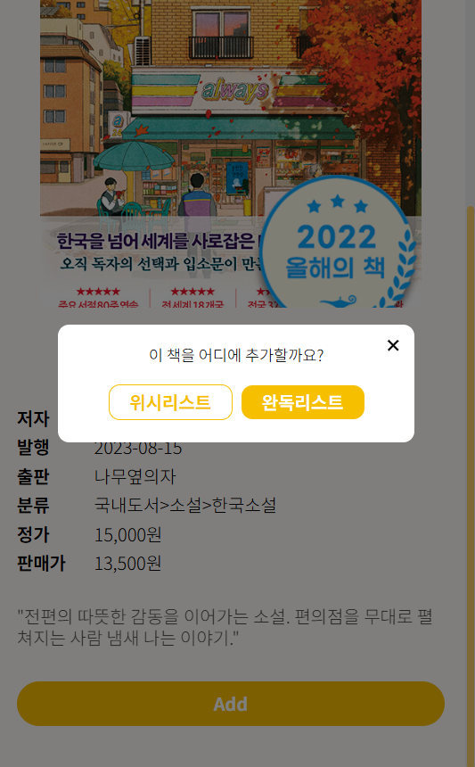
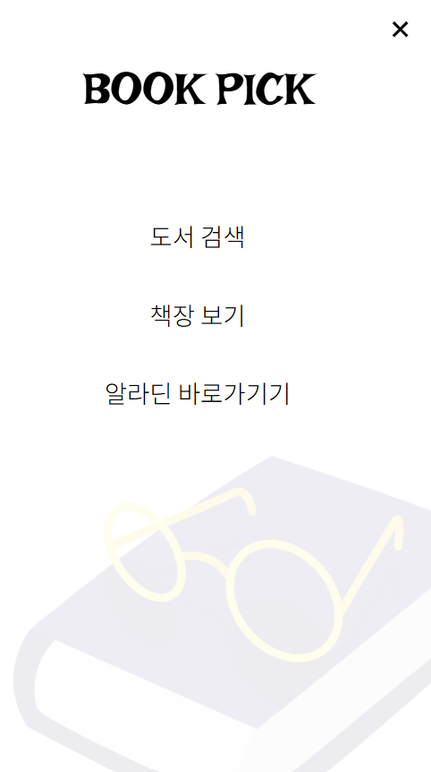
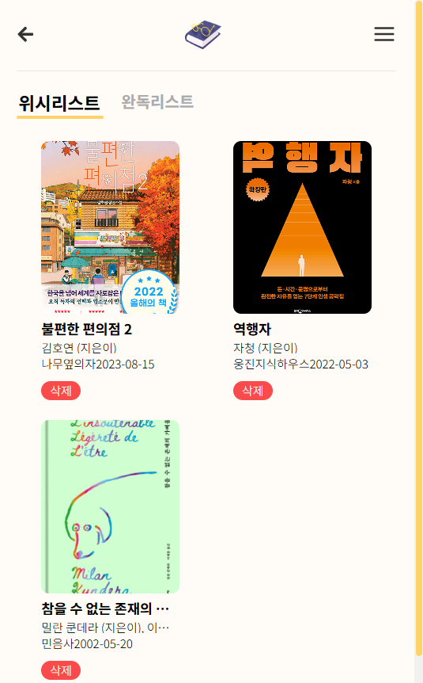

# 프로젝트명: BOOKPICK

### 도서검색및 관리앱👀

### 배포주소

북픽 바로가기: <https://elena7993.github.io/bookpick/>

### 1. 앱 이미지

### 2.목적

- 다양한 도서를 한곳에서 검색할 수 있다.
- 책 정보를 찾고 저장하여 나만의 도서기록을 관리할 수 있다.
- 궁극적으로 책과 더 가까워지고 독서하는 습관을 기를 수 있다.

### 3.기능

- 다양한 키워드로 도서를 검색(책 제목, 저자)
- 추천도서, 카테고리별 도서 보기
- 책장(읽은 책, 읽을 책)에 도서 정리

### 4. 스택

- HTML/CSS, JS, React, Localstorage, Node.js, Figma

### 5. 개발 스케줄

| 날짜     | 작업 내용                                                 |
| -------- | --------------------------------------------------------- |
| 월 09.12 | 프로젝트명 및 기획안 작성 코드 초기세팅 및 깃허브 연동 |
| 화 10.12 | 레퍼런스 조사 및 피그마로 디자인 작업                     |
| 수 11.12 | 공통 컴포넌트 작성 및 홈 화면 구현                        |
| 목 12.12 | 도서 검색 페이지 구현 (디테일 페이지 구현)             |
| 금 13.12 | 즐겨찾기 페이지 구현 (디테일 페이지2 구현)             |
| 토 14.12 | 각 페이지 코드 최종 수정 최종 테스트 및 배포 준비      |
| 일 15.12 | 배포                                                      |

### 6. 개발시 느꼈던 점 📍

알라딘 api를 사용하여 도서데이터를 검색하고 이를 렌더링 하려고 했다.

여기서 발생한 이슈😶‍🌫️ 
CORS문제로 요청이 차단되었고 응답 상태 코드 200으로 OK 였지만 브라우저에서 데이터를 사용할 수 없었다.

문제원인은 알라딘 api 서버가 브라우저의 크로스 오리진 요청을 않는 것과 Access-Control-Allow-Origin에 헤더가 포함되지 않아 브라우저에 요청이 차단된 것.

fetch가 안되었기 때문에 axios로 전환! 
간절한 마음으로 구성을 수정하고 헤더를 추가했지만 동일한 CORS문제가 발생하였다.
AxiosError: Network Error....

api 문제를 해결하지 못해 MockData를 만들기로 결정하고 알라딘 api 응답형식을 참고해 json형식으로 MockData를 만들었다.
이 데이터로 검색 및 도서 정보를 표시하는 UI와 기능은 구현한 셈.

api를 쓰는 법을 배우며 참 재밌고 신기했다. 그리고 여지껏 큰 문제가 없었다. 그래서 제대로 확인하지 않고 작업을 시작한 부분이 패착이란 생각이 든다. api를 선정하고 기획을 진행하는데 api 확인을 대충 한다면 기획부터 흔들리지 않겠나.. 이번 작업에서 아쉬운 부분이 너무 많다. 알라딘에서 충분한 도서를 가져올 수 있었다면 더욱 완성도 있는 앱이 될 수 있었을 것이다. 앞으론 더블체크, 트리플 체크가 필수다✔️✔️✔️
